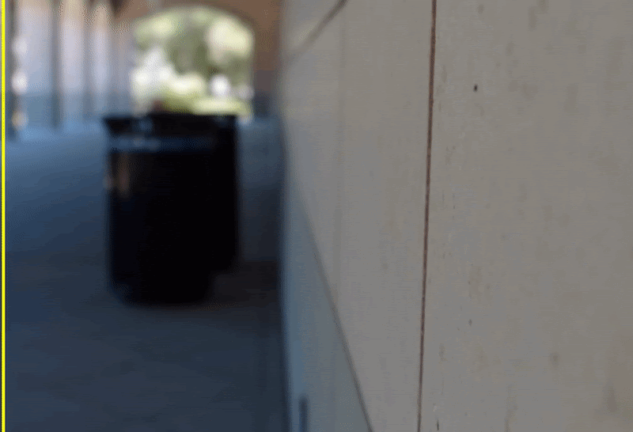

# AIFNet: All-in-Focus Image Restoration Network Using a Light Field-Based Dataset
>[AIFNet: All-in-Focus Image Restoration Network Using a Light Field-Based Dataset](https://ieeexplore.ieee.org/document/9466450)

Lingyan Ruan, [Bin Chen](https://sites.google.com/view/bin-chen/), [Jizhou Li](http://lijz.io/), [Miu-Ling LAM](https://www.scm.cityu.edu.hk/people/lam-miu-ling)

Official Tensorflow implementation of the paper AIFNet. Our network takes defocus image as an input and restore the corresponding all-in-focus image, as shown in the example:

 


## Environment


## LFDOF Dataset
Download our LFDOF dataset from [Project Page](https://sweb.cityu.edu.hk/miullam/AIFNET/).

## Pre-trained weights
Download the pre-trained weights from [Google Drive](https://drive.google.com/file/d/1Gmuo9dGYiXoU-8sPxBEFLceS95GhbCJG/view?usp=sharing). 

## How to test
Put the weights into:
```bash
AIFNet/weights
```
Test our LFDOF test set:
```bash
python test.py -d LFDOF -r 688 -c 1008 -gt 1 -p ./test_set/LFDOF/input -gtp ./test_set/LFDOF/ground_truth
```
You can also run testing on all test sets by:
```bash
python run_test.py
```
To test with your own blurry images into a folder and run for example:
```
python test.py -d [name of your test set] -r [rows] -c [columns] -gt [1: have ground truth; 0: no ground truth] -p [path to your testing image] -gtp [path to your ground truth image if you have]
```

Please note spatial resolution of image sourced from DPD dataset has been reduced when tested on AIFNet since it has limitation dealing with very high-resolution defocused image.


## Relevant datasets

[DUT-DBD dataset](http://ice.dlut.edu.cn/ZhaoWenda/BTBCRLNet.html) : Defocus Blur Detection via Multi-Stream Bottom-Top-Bottom Network

[CUHK dataset](http://www.cse.cuhk.edu.hk/~leojia/projects/dblurdetect/dataset.html) : Discriminative Blur Detection Features

[DPD dataset](https://github.com/Abdullah-Abuolaim/defocus-deblurring-dual-pixel) : Defocus Deblurring Using Dual-Pixel Data

[RTF dataset](https://github.com/codeslake/DMENet/tree/master/evaluation/RTF) : Non-Parametric Blur Map Regression for Depth of Field Extension

## Citation

If you find our code helpful in your research or work please cite our paper.

```
@article{ruan2021aifnet,
    title={AIFNet: All-in-Focus Image Restoration Network Using a Light Field-Based Dataset},
    author={Ruan, Lingyan and Chen, Bin and Li, Jizhou and Lam, Miu-Ling},
    journal={IEEE Transactions on Computational Imaging},
    volume={7},
    pages={675--688},
    year={2021},
    publisher={IEEE}
    doi={10.1109/TCI.2021.3092891}
}
```

## License
This software is being made available under the terms in the [LICENSE](LICENSE) file.

## Acknowledgments
Part of the code is adapted from [DMENet](https://github.com/codeslake/DMENet). 

